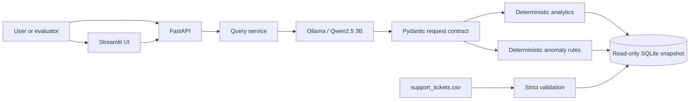

# AI Customer Ticket Support

A local, zero-cost customer-support analytics application that uses
`qwen2.5:3b` for natural-language understanding and deterministic Python/SQLite logic
for every calculation. It validates and ingests the supplied 500-ticket CSV, answers
natural-language questions, detects explainable anomalies, and exposes the same
capabilities through FastAPI and Streamlit.

Repository: [github.com/Ansh1707/ai-customer-ticket-support](https://github.com/Ansh1707/ai-customer-ticket-support)

## What it provides

- Natural-language counts, lists, filters, averages, grouping, and rankings
- Relative and explicit date handling with a visible reference clock
- Abnormally long resolution detection using a documented 1.5×IQR upper fence
- Detection of unresolved High/Critical tickets older than 24 hours
- Explainable evidence, null-aware sample counts, tie handling, and pagination
- REST endpoints for health, questions, and anomalies
- A minimal UI with all five assessment questions and anomaly controls
- One-command startup after the one-time environment setup
- No paid API, cloud model, API key, or external database

## Quick start

### Prerequisites

- Python 3.11
- [Ollama](https://ollama.com/) available on the local machine
- Approximately 2 GB of storage for the Qwen model, plus normal Python dependencies
- macOS or Linux shell commands below; the application was verified on an 8 GB
  Apple M1 MacBook Air

### Tested environment and model

| Item | Verified value |
|---|---|
| Computer | MacBook Air (`MacBookAir10,1`), Apple M1, 8 CPU cores, 8 GB RAM |
| Operating system | macOS 27.0, build 26A428, Apple Silicon arm64 |
| Python | CPython 3.11.12 |
| SQLite | 3.53.4 through Python |
| Ollama | 0.34.1 |
| Model tag | `qwen2.5:3b` |
| Ollama model ID/digest | `357c53fb659c5076de1d65ccb0b397446227b71a42be9d1603d46168015c9e4b` |
| Quantized weights blob SHA-256 | `5ee4f07cdb9beadbbb293e85803c569b01bd37ed059d2715faa7bb405f31caa6` |
| Model details | 3.1B parameters, Q4_K_M, 1,929,912,432 bytes, 32,768-token reported context |
| Application inference settings | temperature 0, seed 0, 4,096-token context, 512 response tokens, one corrective retry |

The installed Ollama artifact reports the **Qwen Research License Agreement**, release
date September 19, 2024. It permits non-commercial research/evaluation use and directs
commercial users to request a separate license. The model weights are not included in
this repository; evaluators download them from the
[Ollama `qwen2.5:3b` entry](https://ollama.com/library/qwen2.5%3A3b). The upstream
[Qwen2.5-3B model card](https://huggingface.co/Qwen/Qwen2.5-3B) is provided for source
attribution. The 3B and 72B variants must not be assumed to use the Apache 2.0 license
used by several other Qwen2.5 sizes.

Verify the installed artifact locally with:

```bash
ollama list
ollama show qwen2.5:3b
ollama show qwen2.5:3b --modelfile
```

### One-time installation

From the repository directory:

```bash
python3.11 -m venv .venv
source .venv/bin/activate
python -m pip install -r requirements.txt
ollama pull qwen2.5:3b
```

Ensure Ollama is running. The macOS Ollama application normally starts its local
service automatically. Otherwise, use a separate terminal:

```bash
ollama serve
```

Start the complete application:

```bash
python run.py
```

The launcher validates and ingests `support_tickets.csv`, checks the model, starts
both services, and waits for them to become ready:

- Streamlit UI: [http://127.0.0.1:8501](http://127.0.0.1:8501)
- FastAPI documentation: [http://127.0.0.1:8000/docs](http://127.0.0.1:8000/docs)
- Health endpoint: [http://127.0.0.1:8000/health](http://127.0.0.1:8000/health)

Press Ctrl+C once in the launcher terminal to stop both services.

## Try the assessment questions

The UI includes these questions as selectable samples:

1. How many tickets are currently open?
2. Which agent resolved the most tickets this month?
3. Show me all Critical tickets not resolved within 12 hours.
4. What is the average customer rating for Technical category tickets?
5. Are there any anomalies in resolution times this week?

The dataset reference clock is `2024-04-05 00:00` dataset-local. With that default,
the verified outputs are:

| Question | Verified result |
|---|---|
| Currently open | 111 tickets |
| Agent resolving the most this month | AGT-07 with 1 ticket from April 1 through April 5 |
| Critical and not resolved within 12 hours | 34 tickets |
| Average Technical customer rating | 3.7403846153846154 from 104 ratings across 152 tickets; displayed as 3.74 |
| Resolution-time anomalies this week | TKT-108 at 119.7 hours, above the 48.15-hour IQR fence |

The expanded live end-to-end suite also covers multi-value and negated filters,
multiple numeric conditions, exact ratings, top-N rankings, grouped output, explicit
anomaly ranges, date-field precedence, paraphrases, and relative dates.

## Architecture



Qwen has one responsibility: translate a question into a structured intent. It does
not calculate results, generate SQL, or write the final answer. The application:

1. routes intent with a small schema;
2. extracts a compact analytics or anomaly plan at temperature 0;
3. preserves explicit user constraints and removes unstated temporal filters;
4. validates the request with Pydantic;
5. executes parameterized, read-only SQLite or deterministic Python logic; and
6. formats the answer from typed results.

This boundary makes numerical outputs reproducible and limits prompt injection to an
untrusted interpretation step that cannot execute arbitrary SQL or mutate data.

| Component | Responsibility |
|---|---|
| CSV ingestion | Validate the exact schema and preserve source-quality warnings |
| SQLite snapshot | Store the checksum-identified dataset transactionally and serve read-only queries |
| Qwen interpreter | Route intent and extract one bounded semantic plan with collection-based numeric conditions and a semantic result limit |
| Pydantic contracts | Reject invalid or out-of-scope model output before execution |
| Analytics engine | Apply allowlisted filters, dates and grouping; enforce semantic ranking before independent transport pagination |
| Anomaly engine | Apply the documented IQR, overdue and source-timing rules with explanations |
| FastAPI | Expose health, query and anomaly contracts with structured failures and diagnostics |
| Streamlit | Call only FastAPI and render controls, evidence, warnings and pagination |
| Launcher | Validate prerequisites, ingest/reuse data, start services and clean up owned processes |

## Data and date semantics

The source contains 500 unique tickets with ten validated fields. Null resolution
times and ratings are preserved for unresolved tickets. The application also preserves
28 suspicious rows where resolution time is shorter than response time and reports
them as data-quality warnings rather than silently repairing the source.

The CSV is a current-status snapshot. It cannot reconstruct what a ticket's status was
on an earlier date. The application therefore exposes three reference modes:

- **dataset:** midnight after the latest inferred dataset event; reproducible default;
- **current:** the computer's current local wall-clock time;
- **custom:** a user-supplied dataset-local timestamp.

For resolved tickets, `resolved_at` is inferred as `created_at + resolution_time_hrs`.
Relative ranges are half-open: the displayed start is included and the end is excluded.
A custom reference before recorded events produces a warning and excludes future-created
tickets from age calculations.

## Anomaly rules

### Long resolution

Resolved-ticket durations use Tukey's 1.5×IQR rule with linear type-7 quartiles over
the full resolved population:

- sample size: 327
- Q1: 6.15 hours
- Q3: 22.95 hours
- IQR: 16.80 hours
- upper fence: 48.15 hours
- flagged tickets: 21

### Overdue high priority

A ticket is flagged when it is Open or Escalated, has High or Critical priority, and
its age is strictly greater than 24 hours at the selected reference time. At the
dataset reference, 80 tickets are flagged. Together, the two operational anomaly
rules produce 101 unique tickets.

### Source timing inconsistency

A record is flagged when its reported resolution duration is shorter than its
first-response duration. The 28 source values are preserved and explained rather than
corrected. Across all three rules, the dataset contains 129 unique flagged tickets.

## REST API

### Health

```bash
curl -s http://127.0.0.1:8000/health
```

Health returns HTTP 200 with `ready` or `degraded`, plus independent dataset, Ollama,
model, and default dataset-reference details.

### Natural-language query

```bash
curl -s http://127.0.0.1:8000/query \
  -H 'Content-Type: application/json' \
  -d '{"question":"How many tickets are currently open?","limit":50,"offset":0}'
```

Custom reference example:

```bash
curl -s http://127.0.0.1:8000/query \
  -H 'Content-Type: application/json' \
  -d '{
    "question":"Show unresolved Critical tickets",
    "reference_mode":"custom",
    "custom_reference":"2024-04-05T00:00:00"
  }'
```

### Anomalies

```bash
curl -s 'http://127.0.0.1:8000/anomalies?rule=long_resolution&period=this_week'
```

`/anomalies` supports `rule`, `period`, `time_field`, `reference_mode`,
`custom_reference`, `limit`, and `offset`. It remains usable if Ollama is offline.
The complete contract is documented interactively at `/docs` and in
[docs/REST_API.md](docs/REST_API.md).

## Testing

Run the fast deterministic and integration suite:

```bash
python -m pytest -q
```

Run linting and dependency checks:

```bash
python -m ruff check src tests run.py
python -m pip check
```

Run the opt-in local-model suite while Ollama is running:

```bash
RUN_LIVE_OLLAMA=1 python -m pytest -q tests/live -s
```

Run the separate Step 25 labeled evaluation while Ollama is running:

```bash
python scripts/evaluate_qwen.py
```

The 51-case development/regression benchmark includes all five assessment samples, 42
cases outside the exact prompt examples, contrast pairs for quoted literals, polarity,
date fields and numeric conditions, plus rankings, anomalies, ambiguity, unsupported
requests, and prompt injection. These cases were used during development and are not
presented as an untouched final test set. Expected
interpretations and independently calculated answer evidence are stored in
[`evaluation/qwen_eval_cases.json`](evaluation/qwen_eval_cases.json). The final
measured report is [`docs/QWEN_EVALUATION.md`](docs/QWEN_EVALUATION.md); the preserved
first-run baseline is [`docs/QWEN_EVALUATION_INITIAL.md`](docs/QWEN_EVALUATION_INITIAL.md).

The ten supplied-file regression facts and complete boundary matrix are documented in
[docs/DETERMINISTIC_VERIFICATION.md](docs/DETERMINISTIC_VERIFICATION.md).
The current clean-environment, browser, API and shutdown evidence is recorded in
[docs/END_TO_END_VERIFICATION.md](docs/END_TO_END_VERIFICATION.md).
The presentation sequence and design answers are in the
[30-minute walkthrough](docs/WALKTHROUGH.md).

Run the final local repository-content audit with:

```bash
python scripts/audit_repository.py
```

Verification results:

- 208 deterministic and integration tests passed; 34 live tests are skipped by default
- 34 of 34 live `qwen2.5:3b` tests passed in 138.26 seconds
- the 51-case Qwen development/regression evaluation passed 51/51, including all 42
  cases outside exact prompt examples; mean latency was 7.21 seconds and P95 was 13.61 seconds
- exact pinned dependencies installed into a new Python 3.11 environment
- Ruff, compilation, `pip check`, HTTP readiness, and graceful shutdown passed

## Configuration

The defaults work without a `.env` file. Optional environment variables are:

| Variable | Default | Purpose |
|---|---|---|
| `OLLAMA_BASE_URL` | `http://127.0.0.1:11434` | Ollama service |
| `OLLAMA_MODEL` | `qwen2.5:3b` | Local model name |
| `OLLAMA_CONNECT_TIMEOUT` | `3` | Connection timeout in seconds |
| `OLLAMA_REQUEST_TIMEOUT` | `60` | Total interpretation budget in seconds |
| `OLLAMA_CONTEXT_TOKENS` | `4096` | Context window used by the app |
| `OLLAMA_RESPONSE_TOKENS` | `512` | Structured-response allowance per call |
| `OLLAMA_CORRECTIVE_RETRIES` | `1` | Schema correction attempts |
| `MAX_QUESTION_CHARS` | `2000` | Interpreter question limit |

Launcher options are available with:

```bash
python run.py --help
```

For example, if the default ports are occupied:

```bash
python run.py --api-port 9000 --ui-port 9001
```

## Troubleshooting

Each API response includes an `X-Request-ID` header. Copy that identifier and search
the terminal running `python run.py` for the matching concise JSON diagnostic. Logs
include outcome, model and total latency, retries, validation categories, and stable
error codes without recording questions, prompts, model output, or ticket data. See
[docs/DIAGNOSTICS.md](docs/DIAGNOSTICS.md).

### `Address ... is unavailable`

Stop the existing service using that port or select alternate ports as shown above.
The launcher refuses to take ownership of a process it did not start.

### Ollama or the model is unavailable

```bash
ollama serve
ollama list
ollama pull qwen2.5:3b
```

Only `/query` requires the model. Health, deterministic anomalies, and the UI still
start in degraded mode.

### Inference timeout

The first request can be slower while the model loads. Retry once or increase
`OLLAMA_REQUEST_TIMEOUT`. Latency depends on local CPU, memory pressure, and whether
the model is already loaded.

### Dataset validation failure

Restore the original `support_tickets.csv`. Validation rejects missing or extra
columns, invalid values, duplicate IDs, malformed timestamps, and inconsistent nulls.
The database refresh is transactional, so a failed import does not leave partial data.

### UI cannot reach the API

Use `python run.py` so the launcher configures both services. When starting them
separately, set `TICKET_API_BASE_URL` to the FastAPI base URL before starting Streamlit.

## Known limitations

- The snapshot has no historical status-change events, so past status cannot be
  reconstructed.
- `resolved_at` is inferred because the CSV does not contain an explicit resolution
  timestamp.
- The IQR baseline is global rather than category- or priority-specific.
- `qwen2.5:3b` is a compact local model. Unusual phrasing can require clarification,
  although schema validation and deterministic constraint preservation reduce errors.
- Inference latency varies by hardware and whether Ollama has loaded the model.
- The application supports analytics and anomaly review; it does not mutate tickets,
  predict future outcomes, or query external customer systems.
- The API binds to localhost by default and has no authentication. It is intended for
  local assessment use, not direct public-network deployment.

## Project layout

```text
run.py                         single-command launcher
support_tickets.csv            supplied immutable dataset
src/ticket_support_ai/
  ingestion.py                 strict CSV validation
  database.py                  transactional SQLite snapshot
  dates.py                     reference clocks and calendar ranges
  schemas.py                   shared validated contracts
  analytics.py                 deterministic read-only queries
  anomalies.py                 explainable anomaly rules
  llm.py                       Ollama/Qwen structured interpretation
  query.py                     orchestration and answer formatting
  api.py                       FastAPI endpoints and safe errors
  ui.py                        API-only Streamlit interface
  launcher.py                  process startup and shutdown
tests/
  unit/                        deterministic component tests
  integration/                 service and HTTP contract tests
  live/                        opt-in real-Qwen tests
docs/                          detailed design and verification evidence
```

Detailed implementation notes are indexed in [docs/PROJECT_STRUCTURE.md](docs/PROJECT_STRUCTURE.md).
